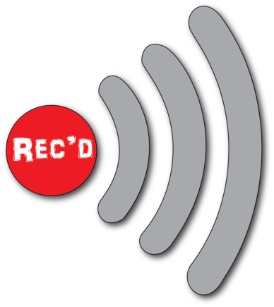

# Rec'd

Rec'd is a crossplatform application for recording online mp3 streams to disk

## Techonology
 
 - Node-webkit for interface
 - Node.js for streaming and saving files
 - Grunt for build processes

## Get Rec'd

 - Head to releases page on [Github](https://github.com/aeewhite/Recd/releases) and download the latest version for Mac OS X or Windows
 - For Mac, just extract the zip and run the Recd.app file
 - For Windows, extract the zip and run Recd.exe
	 - The windows version is not yet tested 

## Instructions

 1. Enter url of mp3 stream in the URL box
	 - This can be found as the first item in an m3u file that contains the stream
 2. Select an .mp3 file to save the stream to (must be .mp3)
 3. Press the record button

## Building

First run `npm install` to pick up the dependencies. I use [Grunt](http://gruntjs.com/) for building the [NW.js](https://github.com/nwjs/nw.js) apps for mac and windows. To build all for both platforms, run the package task with `grunt package`. To build only one platform, run `grunt package:mac` or `grunt package:win`. I've started writing release scripts for mac and windows that will run the build and then zip it all up for github releases. That can be run with `npm run release-mac` (and, when it's finished, `npm run release-win`). For running the project temporarily, you can use `npm start` which will start a NW instance (requires node-webkit to be installed).
